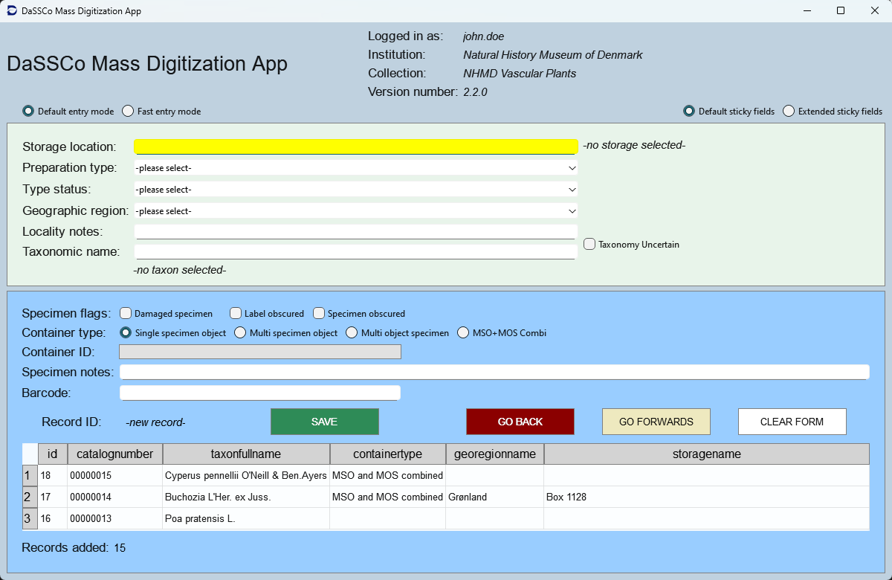

# DaSSCo Mass Digitization App 

## Purpose of the application
The DaSSCo project is tasked with digitizing millions of specimens. To speed this process along, there needs to be a way to rapidly fill in data on 'storage', 'taxonomy', etc. The Mass Digitization App is here to achieve this goal. 

### Installation
Installation is done using a setup file that will ensure all dependencies are in place. The installer will also add a clean local database for registering entries in a "DaSSCo" folder under the user's documents folder. Be mindful to backup the database file upon reinstallation, so it is not overwritten and and data in it erased.   

Downloads: 
(https://github.com/NHMDenmark/DaSSCo/releases/)  

#### University of Copenhagen PCs

Please note that for any PCs administered by the University of Copenhagen, special permissions are required to install any non-standard software, which includes the DaSSCo Mass Digitization App. These permissions are mediated by the Heimdal Agent installed on all KU-IT computers. You can find instructions on how to do so on KUs intranet here: [Install software - administrator rights](https://kunet.ku.dk/employee-guide/Pages/IT/KU-computer.aspx?searchHitHighlight=heimdal)

### Usage

#### Log in 
Upon execution, users need to log in using their [Specify](https://www.specifysoftware.org/) account credentials. Any account from any installation (e.g. [NHMD](https://specify-snm.science.ku.dk/specify/), [NHMA](https://specify-nhma.science.ku.dk/specify/) or [AUH](https://specify-au.science.ku.dk/specify/)) would do, no matter what data specifically is being digitized. For this step, an internet connection is required, but once successfully logged in, the app can work offline. Anyone without a Specify account can request one by writing an e-mail to DNHM's Specify team here: specify@snm.ku.dk 

#### Data entry  
After log in, the data entry form is immediately shown, which is divided into three sections, with the header section holding general info and data entry controls. The two data entry sections (green & blue) feature a range of different types of fields for rapid data entry for each specimen. There are five types of fields: Auto-suggest fields, dropdownlists, free text fields, checkboxes and radio button groups. Whenever an entry is made into a field (i.e. followed by a press on the Enter key or mouse click respectively), focus is immediately transferred to the next field. The tab keys can also be used to navigate field, with Shift-Tab going backwards. 

Auto-suggest fields, such as *Storage location* and *Taxonomic name*  will show a range of possible choices based on a minimum of three keystrokes. The suggestions can be navigated using the arrow down (and up) keys and selected using the Enter key. Any taxonomic names unknown to the taxonomic spine bundled with the app at the time of compilation, will be saved verbatim as-is with the rank and parent taxon guessed by the app.

 Some of these fields are sticky, meaning that upon saving the data for one specimen, the contents of these fields are automatically transferred to the next entry. Exactly what fields are sticky can be modulated using the sticky field controls in the top right corner. To the top left there are the entry mode controls that help modulate what fields are skipped with focus more directly going to the record "SAVE" button. 



#### Navigation between records  
You can follow the progress in the "Previous records table" near the bottom of the app. The "Back" and the "Forward" buttons are for paging through already entered records. You can enter a new record, by pressing "GO FORWARDS" at the last record encountered. 

### Data export  
All entries are stored locally in a sqlite database in the end user's DaSSCo folder. The contents of the database can be viewed exported

### Licence and authorship
The application comes under the Apache-2.0 license which aligns with the Open Source and Open Science frameworks. 
  
Primary author:  Fedor A. Steeman, NHMD  
Primary designer: Pip Brewer, NHMD

## Systems Architecture 

The app is written in python and consists of frontend components for easy user interfacing and backend component capable of both local storage and accessing external systems. The app is bundled with a local database file that is placed in a "DaSSCo" folder on the system it's installed on. In order to log on, and perform other functions, it needs to be connected to the internet. With the current state of the app, there are certain backend functions that have to be run by the developers in the development environment. 

More information on the Systems Architecture including a visual representation, see here: [Systems Architecture](https://github.com/NHMDenmark/Mass-Digitizer/blob/main/documentation/SystemsArchitecture.md)

## For Developers 

### Structure
The app interfaces with a local SQLite database with tables containing predefined data needed for operations and data entry. The specimen data is recorded in the specimen table in a flat format to make exports easier. The exported data is to be imported into the respective Specify database using Workbench, although a more direct pipeline will eventually be established. The app is capable of interfacing directly with the Specify7 API of a given installation, chiefly used for . 

### Compilation  

Whereas development is recommended to be done in the MassDigitizer subfolder, compilation should be done from the root. 

Remember to activate the python virtual environment (venv) and then first run: 
```
python -m pip install --upgrade pip
pip install -r requirements.txt
```

For creating the executable, we use PyInstaller (https://pyinstaller.org/) using this CLI command run from the root folder:
```
pyinstaller .\MassDigitizer\DaSSCo.py --onedir --noconsole --noconfirm --paths=MassDigitizer\
```  

For creating the installer, we use [Inno Setup](https://jrsoftware.org/isinfo.php) and a definition file is located in the repo root [DaSSCO.iss](https://github.com/NHMDenmark/Mass-Digitizer/blob/main/MassDigitizer/DaSSCo.iss). The Inno Setup scripts bundles the database with the executable into an installer file. Before running the Inno Setup script, it is necessary to fill the database file with the taxonomic spine and other predefined data. 

#### Preparing Database File for Bundling 

As part of the source code, there is a skeleton sqlite database file that needs to be filled with pre-defined data, not in the least the taxonomic spines for each collection. Before creating the installer, a temporary copy of the database file is generated that is then filled with the predefined data. Under [MassDigitizer/sql/editions](https://github.com/NHMDenmark/Mass-Digitizer/tree/main/MassDigitizer/sql/editions/) there are folders for each collection containing the SQL statements needed to insert not only taxonomic names, but also other predefined data specific for that collection such as storage locations, preparation types and type statuses. The overall database structure is defined in a [dedicated SQL file](https://github.com/NHMDenmark/Mass-Digitizer/tree/main/MassDigitizer/db/create_db.sqlite3.sql). This allows us to have version control of the entire database structure and its contents by storing it all as text files. 

In the root of this folder there is a batch file ([prepare-db.bat](https://github.com/NHMDenmark/Mass-Digitizer/tree/main/MassDigitizer/sql/editions/prepare-db.bat)) that needs to be run in order to execute the sql statements. The resulting updated db.sqlite3 file is located in the [temp](https://github.com/NHMDenmark/Mass-Digitizer/tree/main/MassDigitizer/sql/editions/temp) folder from where it will be picked up by Inno Setup for being bundled with the installer.  

**NOTE:** In order to run the batch file, you need to install [sqlite command tools](https://sqlite.org/download.html) first and make sure its path is added to your machine's PATH environment variables. 

#### Collections currently supported

Here follows a table for the different collections supported so far: 

| **Institution**   | **Collection**  | **Path**          | **Remarks**                                                                  |
|-------------------|-----------------|-------------------|------------------------------------------------------------------------------|
| NHMD (Copenhagen) | Vascular Plants | NHMD\tracheophyta |                                                                              | 
| NHMD (Copenhagen) | Entomology      | NHMD\entomology   |Taxon spine restricted to selected taxa under Coleoptera & Lepidoptera        |
| NHMA (Aarhus)     | Entomology      | NHMA\entomology   |                                                                              |

#### Compilation process steps  

So the process for compilation is as follows: 
1. Create the executable using PyInstaller
2. Run the batch file to prepare the database
3. Run the Inno Setup script to create the installer

The installer is then placed in folder Mass-Digitizer\MassDigitizer\Output ready for distribution. 

**NOTE:** For NHMD Vascular Plants, the taxon spine is recorded as sets of csv files that are placed in folder ([Mass-Digitizer/tree/main/data/taxon spines/Botany](https://github.com/NHMDenmark/Mass-Digitizer/tree/main/data/taxon%20spines/Botany)). The respective SQL statements have been generated on the basis of those files using the python script ([prepare-db.py](https://github.com/NHMDenmark/Mass-Digitizer/blob/main/MassDigitizer/prepare-db.py)). If changes are made to the taxon spine files, this script will need to be rerun. This will take many hours and should therefore not be a part of the standard compilation process. 

